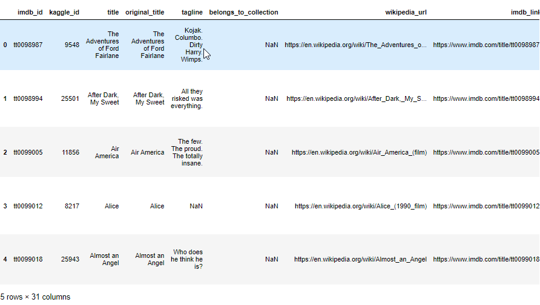

# Movies - Extract, Transform, Load

## Overview
The purpose of this analysis was to perform an ETL using Python and the Pandas library to create an automated pipeline that extracted movie rating data from Wikipedia, Kaggle and MovieLens takes in new data, transform the data into one dataset, and load that data into existing tables in PostgreSQL. 

The transformed data from the three datasets yielded the table below.
 

